  
  

<h3 align="center">Stack técnico</h3>

<table align="center">
  <tr>
    <td align="center" width="460">
      
    </td>
    <td align="center" width="240">
      
    </td>
  </tr>
</table>

<h3 align="center">Sobre mí</h3>

  Soy estudiante de <b>Ingeniería en Informática</b>, y en el día a día armo sistemas de gestión completos 
  para el sector público — desde la base de datos hasta la pantalla que termina usando la gente.  
  Si tengo que elegir una parte del proceso, me quedo con el frontend: ahí es donde más disfruto trabajar. 
  Ahora mismo estoy profundizando en <b>diseño de interfaces</b>, metiéndome de lleno en el mundo de <b>Docker</b>, 
  y afianzando <b>Java con Spring Boot</b>.

<h3 align="center">Actividad</h3>

  

